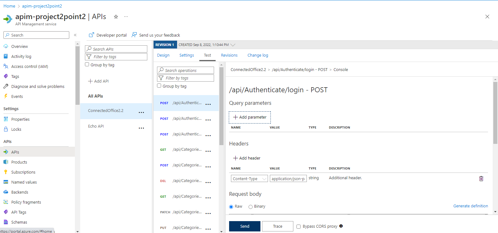
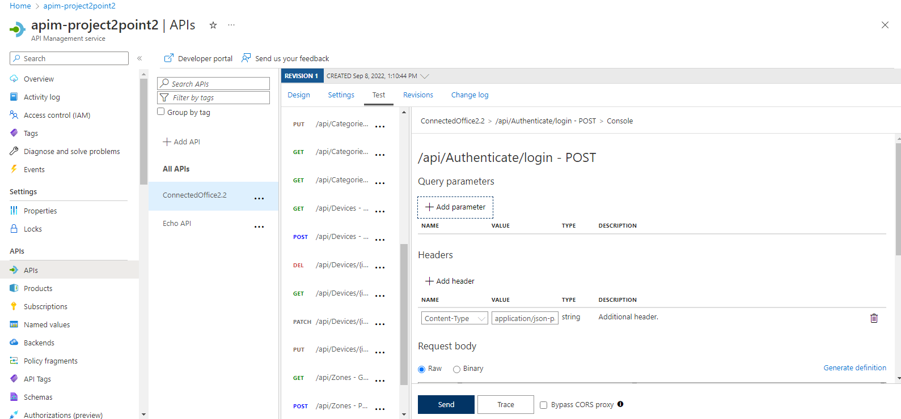
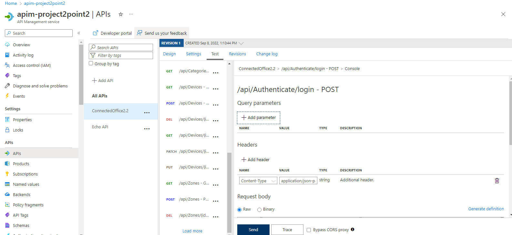

# Project2_API

NOTE NOTE NOTE: please mark the api in the apim-Project2point2 thats the updated version i didnt want to delete the api in apim-project2point1 incase something went with the redeployment of the final api.

The below are the the steps on on how to access my api from azure 
login creditendial;s : 
34228128@student365.msfed.nwu.ac.za
password: Be@stm0de

use the following login authenticals credidentials for the test (this is a already registered use) in the Authentication controller:
username : "dave"
password: "Abc123!@"

once granted access copy the token and go to the top right of the page there should be an authorize button. 
click it and then type "BEARER " and paste the token

from there you can test out all the end points. Below ill be explaining what each end point does under the specific catergory 

Under the categories controller (the controller tab on the swagger page)
Get:api/category : GET method that retrieves all Category entries from the database
Get:api/category {id} : GET method that will retrieve one Category from the database based on the ID parsed through
Post: api/category:  POST method that will create a new Category entry on the database
Patch: api/Category{id}:  PATCH method that will update an existing Category entry on the database 
Delete api/Category{id} DELETE method that will delete an existing Category entry on the database and checks if a Category exists (based on the ID parsed through) before editing or deleting an item
Get:api/category {id} /Devices: GET method that retrieves all devices within a specific category (based on the category ID that is parsed through)

Under the Zone controller (the controller tab on the swagger page)
Get: /api/Zone: a GET method that retrieves all Zone entries from the database
Get: /api/Zone{id}: GET method that will retrieve one Zone from the database based on the ID parsed through
Post /api/Zone : POST method that will create a new Zone entry on the database
Delete: api/Zone{id} DELETE method that will delete an existing Zone entry on the database and checks if a Zone exists (based on the ID parsed through) before editing or deleting an item

Under the Devices controller (the controller tab on the swagger page)
Get: /api/Devices: GET method that retrieves all Device entries from the database
Get: /api/Devices {id} : GET method that will retrieve one Device from the database based on the ID parsed through
Post: /api/Devices : POST method that will create a new Device entry on the database
Patch : /api/Devices{id}: PATCH method that will update an existing Device entry on the database
Delete:/api/Devices{id}: DELETE method that will delete an existing Device entry on the database and checks if a Device exists (based on the ID parsed through) before editing or deleting an item

Youll notice that not all end points listed that is just because the some of them are intuitve and that are not listed on the marking sheet 

Below are the screenshots of the API manager from Azur:

</img>
</img>
</img>

